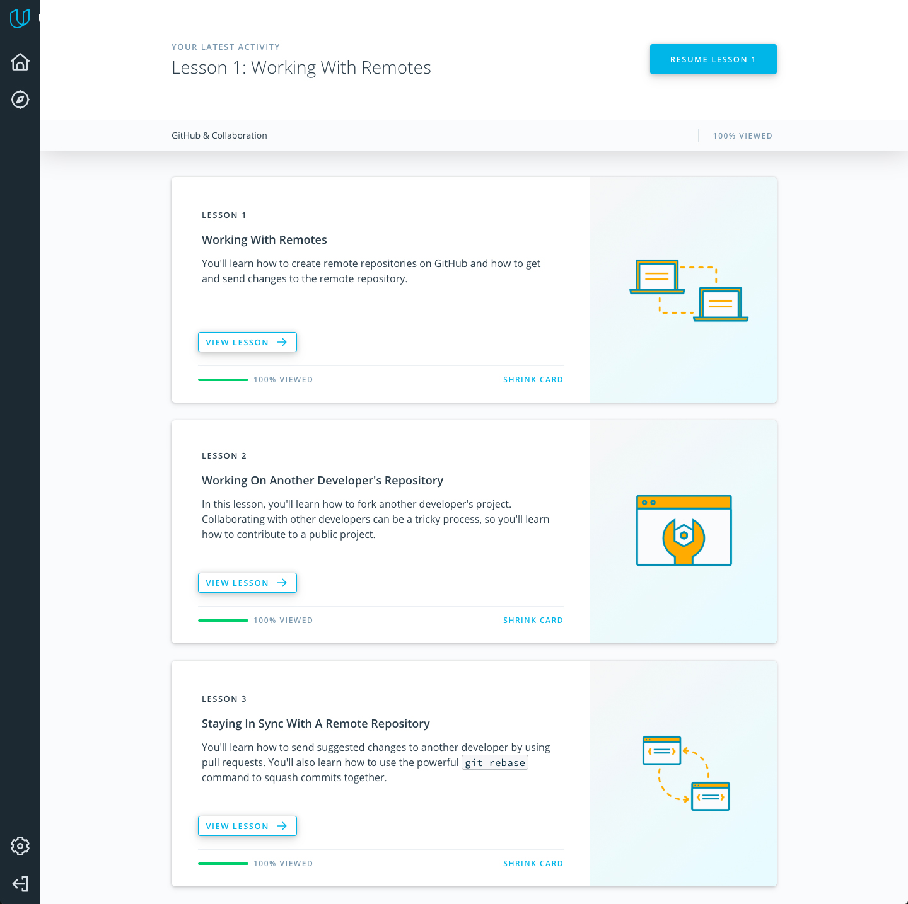
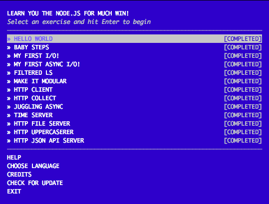
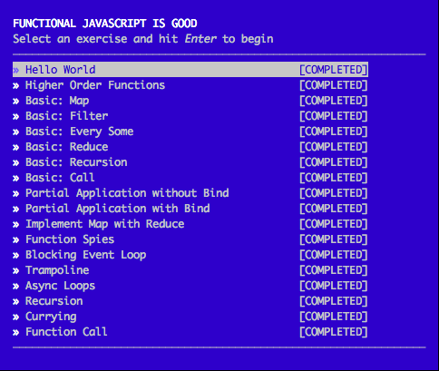
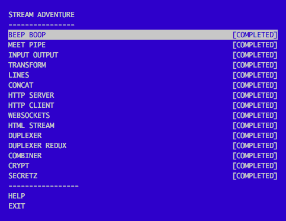

# kottans-backend
## Unix Shell

In Linux Survival course module-1 and module-2 was not hard for me, I useed linux before, but in module-3, module-4 and in  "Learning the Shell" section I learned a lot of new.

## Git Collaboration

## NodeJS Basics 1

